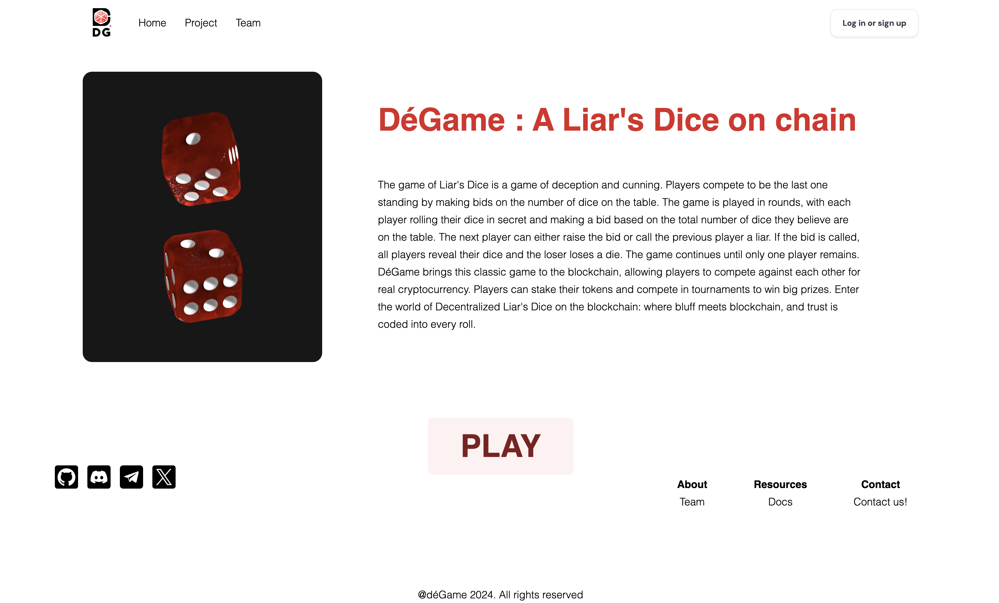
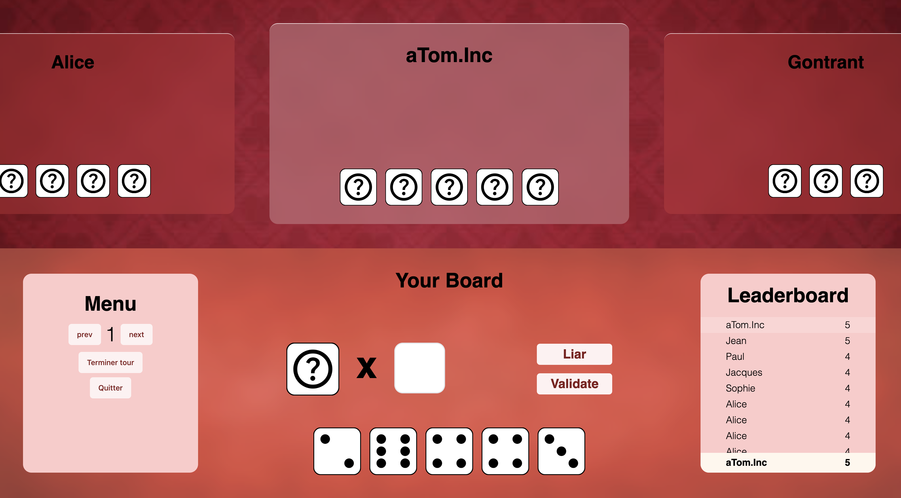

# DéGame

Welcome to the [Liar's dice](https://www.wikihow.com/Play-Liar%27s-Dice) On-Chain project! This project was built during the Brussels ETHGlobal 2024 hackathon. It leverages Inco, the universal confidentiality layer for Web3, to bring the classic game of Liar's Dice onto the blockchain with enhanced security and confidentiality.

## Installation

### Contract

Install the Foundry [cli](https://book.getfoundry.sh/getting-started/installation).

```sh
curl -L https://foundry.paradigm.xyz | bash
cd contract/
```

#### Build:
```sh
forge build
```

#### Tests:
```sh
forge test
```

#### Deploy:
```sh
forge create --rpc-url https://testnet.inco.org --private-key pkey DeGame
```

<br/>

### Frontend

Go to the folder:
```sh
cd client
```
 
Install all the packages:
```sh
yarn install
## or
npm install
```

Run the client 🚀:
```sh
yarn dev
```

Here you can find a few visualizations of our project:





## Made with :white_heart: by:

| [<br><sub>Mohammed JBILOU</sub>](https://github.com/Molaryy) | [<br><sub>Dorian MOY</sub>](https://github.com/Croos3r) | [<br><sub>Tom BARITEAU-PETER</sub>](https://github.com/Tomi-Tom) | [<br><sub>Florian FLAUCH</sub>](https://github.com/EdenComp)
|:---:|:---:|:---:|:---:|
